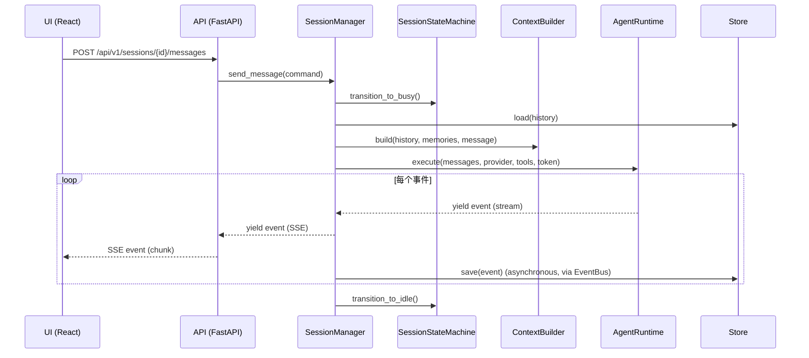

# Architecture: laffybot 整体架构

## 本文目标与范围

本文是 laffybot 的单一架构约束文档，用来回答三件事：

- 系统被分成哪些层，每层的职责边界是什么。
- 依赖允许如何流动，哪些事情明确禁止。
- 扩展点、测试点、故障隔离点在哪里。

非目标：本文不替代实现细节文档；不规定具体数据库表结构与具体提示词内容；不把某次策略参数固化为架构约束。

## 架构原则

本项目的架构设计遵循以下原则，用于约束分层边界和依赖方向：

- 关注点分离：每一层只承担单一职责，表示、业务、数据访问彼此隔离。
- 松耦合：层间仅通过明确的接口或抽象依赖协作，避免直接引用具体实现。
- 高内聚：同一层内的模块围绕同一职责组织，不把跨层逻辑混入其中。
- 可扩展性：新增能力优先通过增加实现、适配器或子模块完成，不破坏既有层次。
- 可测试性：每层都可以独立测试，外部依赖可替换、可模拟。
- 抽象一致：每层暴露与自身职责匹配的抽象，避免底层细节向上泄露。
- 调用单向：调用关系从上层指向下层，下层不反向依赖上层。
- 信息隐藏：层内实现细节默认不可见，仅公开必要接口。
- 以接口为边界：跨层调用必须通过清晰的“端口(Protocol/ABC)”完成；跨层传递的数据必须是稳定的 DTO/事件，不传递对象图。
- 以依赖倒置为默认：上层定义端口，下层提供适配器实现；上层绝不直接 new/选择下层具体实现。
- 以可观测为一等公民：跨层边界必须有统一的 request_id/session_id 贯穿日志与 trace。

## 分层与依赖总览

```
┌──────────────────────────────────────────────────────────────────────────────────────┐
│                                UI 层 (React / TypeScript)                            │
│  职责: 纯表示层, 只负责渲染、交互和状态展示                                            │
│  不负责: 业务规则、数据持久化、LLM 调用                                                │
│  公开接口: HTTP REST + SSE EventSource                                                │
│  内部: ui/src/components/  ui/src/pages/  ui/src/hooks/                              │
│  依赖方向: UI 层 → API 层 (仅通过 HTTP/SSE)                                           │
└──────────────────────────────────┬───────────────────────────────────────────────────┘
                                     │ HTTP (REST) / SSE
                                     ▼
┌──────────────────────────────────────────────────────────────────────────────────────┐
│                            API 层 (FastAPI / Python)                                  │
│  职责: HTTP/SSE 协议适配、输入校验、路由分发                                           │
│  不负责: 会话编排、上下文构建、Agent 执行                                               │
│  公开接口:                                                                             │
│  ├─ POST /api/v1/sessions/{id}/messages → SSE 流                                      │
│  ├─ GET  /api/v1/sessions/{id}/messages → 历史                                        │
│  ├─ GET  /health → 健康检查                                                            │
│                                                                                       │
│  laffybot/api/                                                                        │
│  ├── app.py             FastAPI 应用 + 中间件 + 异常→HTTP 映射                         │
│  ├── router.py          URL 路由聚合                                                   │
│  ├── schemas.py         Pydantic 请求/响应模型                                         │
│  └── dependencies.py    依赖注入 (获取后端服务层的 Protocol 实例)                       │
│                                                                                       │
│  异常→HTTP 映射 (按错误类型和 origin 区分):                                            │
│  ├─ SessionError       → 409 Conflict      (会话状态冲突, 客户端可重试)                │
│  ├─ ProviderError      → 502 Bad Gateway   (上游 LLM 挂了, 非客户端问题)               │
│  ├─ ToolError          → 502 Bad Gateway   (MCP 服务端异常, 非客户端问题)               │
│  └─ 未捕获异常         → 500 Internal      (兜底, 服务端 bug)                           │
│                                                                                       │
│  SSE 流中错误协议 (HTTP 200 后通过事件传递错误):                                       │
│  ├─ event: error                                                                    │
│  │  data: {                                                                          │
│  │    "type": "provider_error" | "tool_error" |                                       │
│  │           "session_cancelled" | "internal_error",                                  │
│  │    "message": string,                                                             │
│  │    "error_code": string,                                                          │
│  │    "recoverable": boolean,                                                        │
│  │    "details": object | null                                                       │
│  │  }                                                                                │
│  ├─ recoverable=true  → UI 显示错误并允许重试                                        │
│  └─ recoverable=false → UI 禁用当前 session 输入                                      │
│                                                                                       │
│  依赖方向: API 层 → 后端服务层 (仅通过 Protocol 接口)                                  │
└──────────────────────────────────┬───────────────────────────────────────────────────┘
                                     │ SessionManager(Protocol) | EventBus(Protocol)
                                     ▼
┌──────────────────────────────────────────────────────────────────────────────────────┐
│                          后端服务层 (业务逻辑 - laffybot/)                             │
│  职责: 会话编排、状态管理、上下文装配、领域级协同                                       │
│  不负责: HTTP 协议、LLM 流式协议、存储引擎细节                                           │
│  公开接口 (跨层):  SessionManager(Protocol)                                              │
│  层内协议 (不跨层暴露): ProviderFactory(Protocol), MemoryManager(Protocol)                │
│                                                                                       │
│  ┌───────────────────────────────────┐  ┌────────────────────────────────────┐        │
│  │ SessionManager (薄协调器)         │  │ 异步事件处理子层                    │        │
│  │ 同步编排                          │  │ AsyncEventProcessor                │        │
│  │                                   │  │ (订阅 EventBus, 无感后台处理)       │        │
│  │ send_message() 事务边界:          │  │                                    │        │
│  │  1. state.transition_to_busy()    │  │ 任务队列(示例):                     │        │
│  │  2. provider = ProviderFactory    │  │ - 自动标题生成 (会话首条消息后)      │        │
│  │  3. history = Store.load()        │  │ - 记忆提取 (归档时)                 │        │
│  │  4. memories = MemMgr.get()       │  │ - 上下文压缩 (达到阈值时)            │        │
│  │  5. ctx = ContextBuilder()        │  │                                    │        │
│  │  6. for event in                  │  │ 可靠性策略(原则):                    │        │
│  │     runtime.execute(...):          │  │ - 失败可重试、可追踪、可补偿          │        │
│  │     yield event                    │  │ - 异步任务不影响主链路响应            │        │
│  │     EventBus.publish(event)        │  │ - SSE 断连通过 Last-Event-ID 重放    │        │
│  │  7. state.transition_to_idle()    │  └────────────────────────────────────┘        │
│  │  8. finally: force_to_idle()      │                                                │
│  │ (仅编排与事务边界, 不含子步骤实现)│  ┌────────────────────────────────────┐        │
│  └──────────────┬─────────────────┘  │ ContextBuilder                     │        │
│                 │                    │ (属后端服务层, 纯装配器, 入参为 DTO)  │        │
│  ┌──────────────▼─────────────────┐  │ - render system prompt             │        │
│  │ SessionStateMachine            │  │ - append history + memories        │        │
│  │ (纯状态机, 无业务规则)          │  │ - append current message           │        │
│  │                                │  │ - prune_tool_outputs               │        │
│  │ transition_to_busy():          │  │ - CompressionDetector              │        │
│  │   lock_port.try_lock() →        │  │ - return (messages, region_info)   │        │
│  │   check idle → update busy →    │  └────────────────────────────────────┘        │
│  │   return (new_state, lock_key)  │                                                │
│  │                                │                                                │
│  │ cancel(): lock_port.try_lock()  │  其他: ProviderStore / McpServerStore /         │
│  │   → set cancel token → unlock   │  AppSettingStore / MemoryStore (共享 DB)        │
│  └────────────────────────────────┘  MemoryManager (层内协议)                         │
│                                        ├─ MemoryInjector (sync)                      │
│                                        │   供 SessionManager.send_message() 注入      │
│                                        └─ MemoryArchiver (async)                     │
│                                            供 AsyncEventProcessor 归档提取            │
│                                                                                     │
│  依赖方向: 后端服务层 → Agent Runtime (execute) | 基础设施层 (EventBus, Store, SessionLockPort)│
└──────────────────────────────────┬──────────────────────────────────────────────────┘
                                     │ AgentRuntime.execute(messages, provider, tools, …)
                                     ▼
┌──────────────────────────────────────────────────────────────────────────────────────┐
│                       Agent Runtime (无状态执行引擎)                                   │
│  laffybot/agent_runtime/                                                             │
│  职责: 纯 AI 对话循环, 只处理模型调用、工具调用和事件流                                 │
│  不负责: 会话状态、存储持久化、业务编排、API 协议                                        │
│  公开接口:                                                                             │
│  AgentRuntime.execute(                                                                │
│      messages: list[Message],                                                         │
│      provider: BaseProvider,        ← 通过 Provider Protocol 解耦                    │
│      tools: ToolRegistry,           ← 通过 ToolRegistry Protocol 解耦                │
│      model: str,                                                                      │
│      max_iterations: int,                                                             │
│      cancellation_token: CancellationToken                                            │
│  ) → AsyncGenerator[SSEEvent]                                                         │
│                                                                                       │
│  AgentRunner (内部实现, 对外不可见):                                                   │
│    1. provider.chat_completion_stream(messages, model, tools_schema)                  │
│    2. 透传 content / reasoning 事件流                                                  │
│    3. 处理 tool_calls:                                                               │
│       a. yield tool_call event                                                        │
│       b. tools.execute(name, args)                                                    │
│       c. yield tool_result event                                                      │
│       d. 追加结果到内部消息历史                                                        │
│    4. 无 tool_calls → break                                                           │
│                                                                                       │
│  内部消息历史: 不持久化, 生命周期限于单次 execute                                      │
│                                                                                       │
│  ┌──────────────────┐  ┌────────────────────────┐  ┌────────────────────────┐        │
│  │ BaseProvider (ABC)│  │ ToolRegistry (Protocol)│  │ CancellationToken      │        │
│  │                  │  │                        │  │ (异步取消信号)         │        │
│  │ chat_completion_ │  │ execute(name, args)     │  │                        │        │
│  │ stream()         │  │ get_tools_schema()      │  │ ─ 状态机 cancel()     │        │
│  │                  │  │                        │  │   设置 token →        │        │
│  │ 实现:            │  │ 实现:                  │  │   AgentRunner 检查 →   │        │
│  │ OpenAIProvider   │  │ ┌─ BuiltinRegistry     │  │   中断循环            │        │
│  │ AnthropicProvider│  │ │  exec/read/write/…  │  └────────────────────────┘        │
│  │ … (按 Provider   │  │ └─ McpToolRegistry    │                                    │
│  │   Protocol 实现) │  │   代理到 MCPManager   │                                    │
│  └──────────────────┘  │ └─ CompositeRegistry  │                                    │
│                         │   组合多个 Registry    │                                    │
│                         └────────────────────────┘                                    │
│                                                                                       │
│  信息隐藏: AgentRunner / 内部消息历史 / Provider 实现细节 → 对外不可见                 │
│  依赖方向: Agent Runtime → 外部基础设施 (LLM API, MCP Servers)                        │
└──────────────────────────────────┬──────────────────────────────────────────────────┘
                                     │
                                     ▼
┌──────────────────────────────────────────────────────────────────────────────────────┐
│                             基础设施层 (共享服务)                                      │
│  职责: 被上层依赖的公共服务, 不属于任何业务层                                           │
│  不负责: 领域编排、UI 呈现、对话循环                                                   │
│                                                                                       │
│  ┌────────────────────────┐  ┌────────────────────────┐  ┌────────────────────────┐  │
│  │ 事件总线 (EventBus)     │  │ 持久化存储层             │  │ 可观测性              │  │
│  │                        │  │                         │  │                       │  │
│  │ 接口:                  │  │ laffybot/db/            │  │ ├─ GET /health        │  │
│  │  publish(event)        │  │ ├─ BaseStore (ABC)     │  │ ├─ 结构化日志         │  │
│  │  subscribe(session_id, │  │ ├─ SessionStore        │  │ ├─ OpenTelemetry      │  │
│  │    handler)            │  │ ├─ ProviderStore       │  │ │  tracing            │  │
│  │                        │  │ ├─ MemoryStore         │  │ └─ Prometheus metrics │  │
│  │ 内部: asyncio.Queue +  │  │ ├─ McpServerStore     │  │                       │  │
│  │ session_id 路由        │  │ └─ AppSettingStore    │  │                       │  │
│  │ (按 session 隔离事件)   │  │                         │  │                       │  │
│  └────────────────────────┘  └────────────────────────┘  └────────────────────────┘  │
│                                                                                       │
│  外部依赖 (不属于本项目代码):                                                          │
│  ┌──────────────┐  ┌──────────────────────┐  ┌────────────────────────────────┐     │
│  │  SQLite (WAL) │  │  LLM API              │  │  MCP Servers                    │     │
│  │              │  │  OpenAI / Anthropic / │  │  Stdio / SSE / HTTP             │     │
│  │              │  │  OpenRouter / 本地    │  │  文件系统 / 搜索 / 数据库       │     │
│  └──────────────┘  └──────────────────────┘  └────────────────────────────────┘     │
└──────────────────────────────────────────────────────────────────────────────────────┘
```

### 依赖矩阵 (允许/禁止)

| From \\ To | UI | API | 后端服务层 | Agent Runtime | 基础设施层 |
| --- | --- | --- | --- | --- | --- |
| UI | - | 仅 HTTP/SSE | 禁止 | 禁止 | 禁止 |
| API | 禁止 | - | 仅 Protocol | 禁止 | 禁止 |
| 后端服务层 | 禁止 | 禁止 | - | 仅 execute() 端口 | 仅 EventBus/Store/SessionLockPort 等端口 |
| Agent Runtime | 禁止 | 禁止 | 禁止 | - | 仅外部 Provider/MCP 适配器 |
| 基础设施层 | 禁止 | 禁止 | 禁止 | 禁止 | - |

约束落地方式（建议写入代码审查准则）：

- “仅 Protocol”意味着：API 层不得直接 import 具体 Store/DB 实现；后端服务层不得依赖具体 Provider SDK；这些只能通过依赖注入拿到端口实现。
- “禁止”意味着：出现 import/调用就视为架构违规，需要通过适配器或端口重构。

## 分层协作规则

- UI 层只调用 API 层，不直接依赖后端服务层或基础设施层。
- API 层只做协议转换与输入输出校验，不承载业务判断。
- 后端服务层只通过抽象接口协作，核心编排逻辑不依赖具体存储或具体 Provider 实现。
- Agent Runtime 只接受已组装好的上下文并产出事件，不直接访问业务状态。
- 基础设施层只提供可复用能力，不向上反向引用业务层。
- 任何跨层能力都应通过协议、适配器或组合器显式连接，避免隐式耦合。

跨层数据规则：

- UI ↔ API：只交换稳定的 HTTP DTO + SSE 事件；前端不解析后端内部状态机细节。
- API ↔ 后端服务层：只交换输入命令(Command)与输出事件(Event)；不把 ORM/DB model、Provider SDK 对象穿透到上层。
- 后端服务层 ↔ Agent Runtime：只传入组装好的 `messages + tools_schema + cancellation_token`，只接收标准化事件流。

版本化规则：

- `/api/v1` 只允许向后兼容的增量演进（字段可新增不可删改语义；SSE event type 可新增不可复用旧含义）。
- Provider/Tool 扩展必须通过新增实现完成，禁止在上层写 if/else 选择具体厂商协议。

并发与取消规则：

- `SessionStateMachine` 是会话并发控制的唯一事实来源；任何导致并发写入的路径都必须先拿到状态机许可。
  并发锁通过 `SessionLockPort` (Protocol) 获取；状态机内部协调锁的获取与释放，不直接感知 DB 行级锁等实现细节。
- 取消只通过 `CancellationToken` 传播；禁止用“抛异常到处 catch”模拟取消语义。

## 可测试性约束

- UI 层可通过静态接口和交互测试验证渲染与事件触发。
- API 层可通过请求/响应测试验证协议适配和错误映射。
- 后端服务层可通过替换 Store、EventBus、Provider 的模拟实现验证编排逻辑。
- Agent Runtime 可通过固定消息与模拟 Provider/ToolRegistry 验证事件流产出。
- 基础设施层可通过单元测试验证持久化、路由和事件分发行为。

建议的测试分层（对应上述依赖矩阵）：

- Contract tests：固定 SSE 事件格式与 API 响应模型，确保 UI 升级与后端升级互不阻塞。
- Service tests：后端服务层用 Fake Store/Fake EventBus/Fake ProviderFactory/Fake SessionLockPort 覆盖编排、并发与取消。
- Runtime tests：Agent Runtime 用 Fake Provider + InMemory ToolRegistry 覆盖 tool_call/tool_result 循环与中断。

## 端到端时序 (关键链路)

> 目标：把“谁负责什么”落实到一次请求的可执行路径上。



SSE 断连恢复：Server 维护按 session 隔离的内存 ring buffer（容量 N=100 event），落盘同时入 buffer。客户端重连时通过 `Last-Event-ID` 请求缺失事件；Server 优先查 ring buffer，未命中则回查 Store。ring buffer 丢失等同于客户端重连时最后一条持久化记录之后的 event 丢失——已推送的内容不受影响，未推送的通过用户重试恢复。

## 扩展点

- 新 Provider：实现 `BaseProvider`/Provider Protocol；由 `ProviderFactory` 选择与装配；上层不感知厂商差异。

  `ProviderFactory` 契约：
  ```
  class ProviderFactory(Protocol):
      """后端服务层定义的端口：Provider 选择与装配。

      职责：根据会话配置选择 Provider 实现并返回已配置实例。
      实现依赖 ProviderStore（基础设施层）读取 API Key / endpoint 等配置。
      调用方不感知具体厂商 SDK。
      """
      def get_provider(
          provider_type: str,
          model: str,
      ) -> BaseProvider: ...
  ```
- 新 Tool：实现 ToolRegistry 端口（或注册到 CompositeRegistry）；Agent Runtime 只依赖工具 schema 与执行端口。
- 新 Store/DB：实现 Store 端口；后端服务层只通过端口读写历史、记忆与配置。

## 常见反模式 (明确禁止)

- API 层直接读写数据库或直接调用 Provider SDK。
- 后端服务层拼 SSE 文本或关注 HTTP 状态码细节。
- Agent Runtime 读取/写入会话存储、持有跨请求的会话状态。
- 基础设施层 import 业务层模块或回调业务层具体实现（违反单向依赖）。
